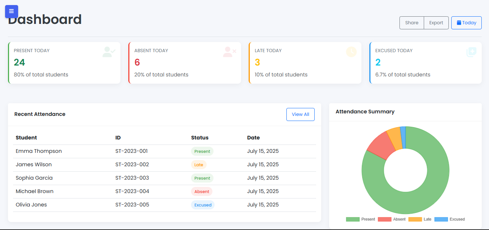

# Student Attendance Manager

A modern, responsive web application for managing student attendance with an intuitive user interface.



## Features

- **Dashboard** with attendance statistics and summary charts
- **Take Attendance** with individual and batch options
- **View Records** with filtering capabilities and export options
- **Reports** with detailed analytics and visualization
- **Notifications** for absences and communication with parents
- **Settings** for customizing the application
- **Mobile Responsive** design that works on all devices
- **Student Profile Images** with image preview functionality

## Technologies Used

- HTML5, CSS3, JavaScript
- Bootstrap 5 for responsive design
- jQuery for DOM manipulation
- Chart.js for data visualization
- Flatpickr for date picking
- Toastify for notifications
- DataTables for enhanced tables

## Installation

1. Clone the repository:
   ```
   git clone https://github.com/yourusername/student-attendance-manager.git
   ```

2. Navigate to the project directory:
   ```
   cd student-attendance-manager
   ```

3. Set up the images directory:
   ```
   mkdir -p images
   ```

4. Add student profile images to the images directory:
   - Add images named student1.jpg, student2.jpg, etc.
   - Add a student-profile.jpg for the default profile image

5. Open index.html in your web browser or set up a local server:
   ```
   # Using PHP built-in server
   php -S localhost:8000
   
   # Or using Python's http.server
   python -m http.server 8000
   ```

## Usage

### Dashboard

The dashboard provides an overview of attendance statistics with visual representations:
- Present/absent/late/excused student counts
- Recent attendance records
- Attendance trends
- Upcoming events

### Taking Attendance

1. Navigate to the "Take Attendance" section
2. Choose between single student or batch attendance
3. Search for a student or select from the list
4. Mark their attendance status (present, absent, late, excused)
5. Add any necessary notes
6. Save the attendance record

### Viewing Records

1. Go to the "View Records" section
2. Filter records by date range, status, or student
3. View detailed attendance information
4. Edit or delete records as needed
5. Export records to PDF or Excel formats

### Generating Reports

1. Access the "Reports" section
2. Select report parameters (daily, weekly, monthly, or custom)
3. Choose the report format (summary, detailed, or chart view)
4. Generate the report
5. Export or print as needed

### Managing Notifications

1. Go to the "Notifications" section
2. Configure automatic notification settings
3. Create and send manual notifications
4. View notification history

## Customization

The application can be customized through the Settings panel:
- School information
- Academic year and schedule
- Date and time formats
- Notification preferences
- Theme and appearance

## Project Structure

```
student-attendance-manager/
├── index.html            # Main application file
├── images/               # Student profile images
├── README.md             # Documentation
└── screenshot.png        # Application screenshot
```

## Contributing

1. Fork the repository
2. Create a feature branch (`git checkout -b feature/amazing-feature`)
3. Commit your changes (`git commit -m 'Add some amazing feature'`)
4. Push to the branch (`git push origin feature/amazing-feature`)
5. Open a Pull Request

## License

This project is licensed under the MIT License - see the LICENSE file for details.

## Acknowledgments

- Bootstrap team for the excellent UI framework
- Chart.js for the visualization library
- All contributors who have helped improve this application 